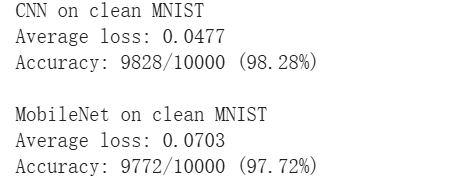
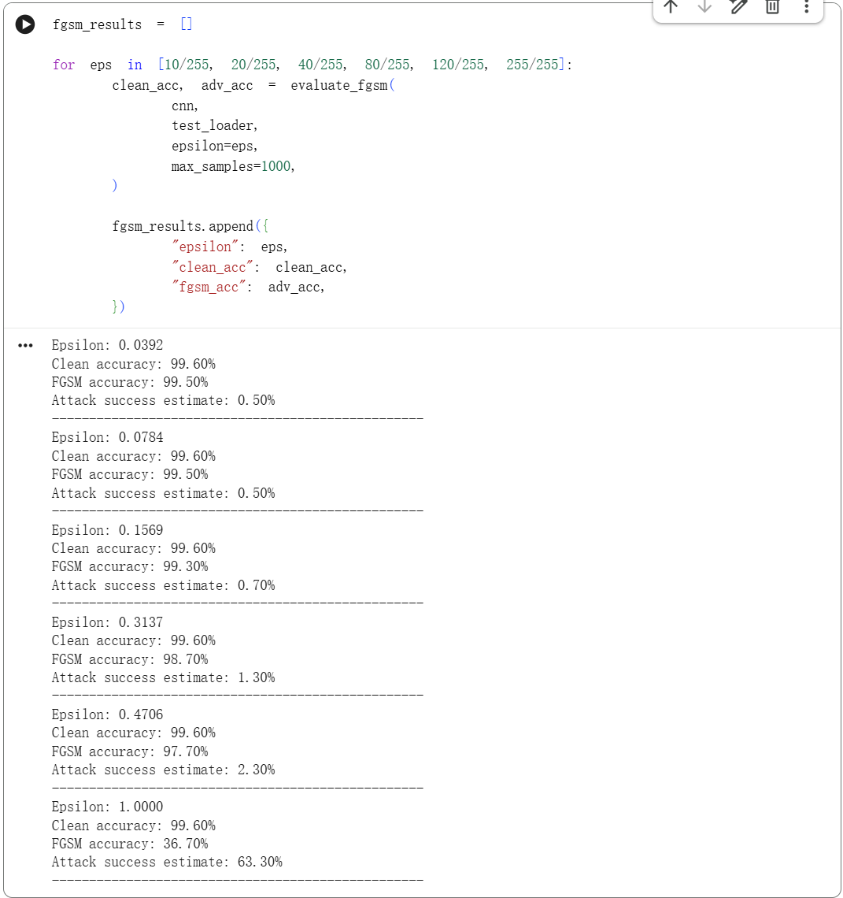
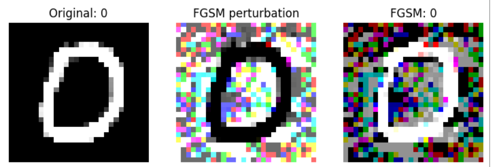
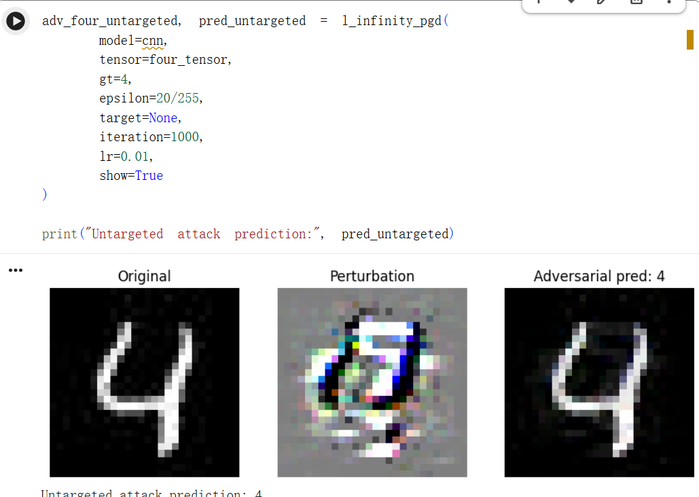
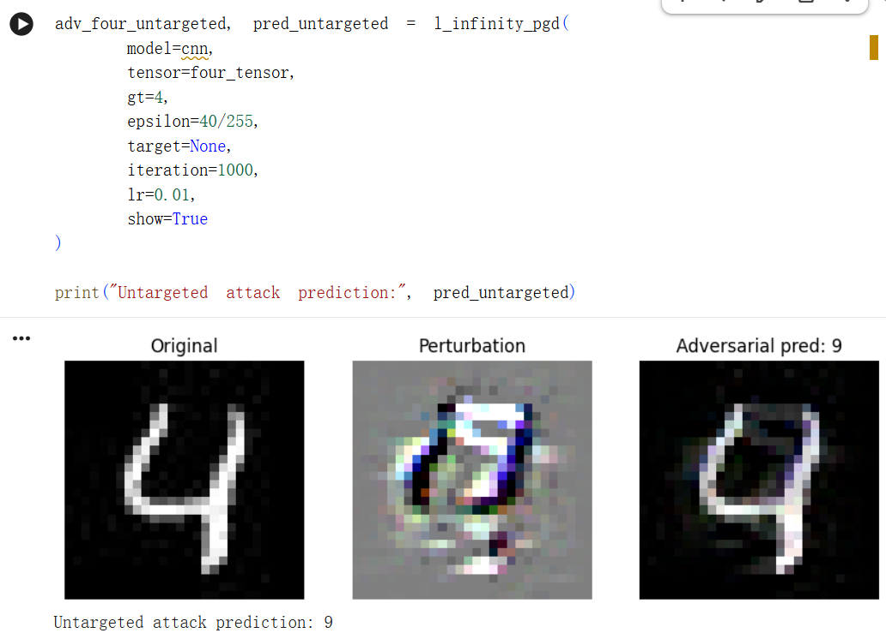
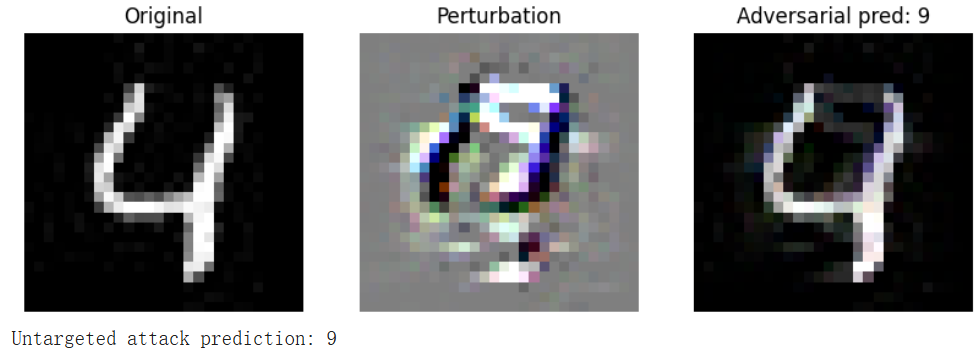
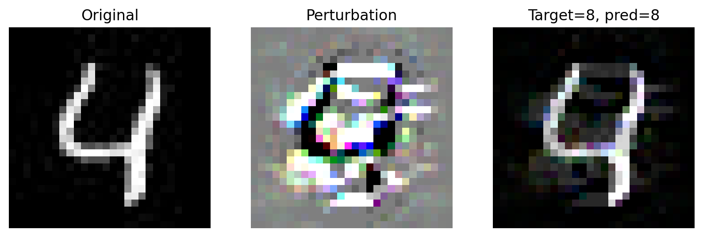
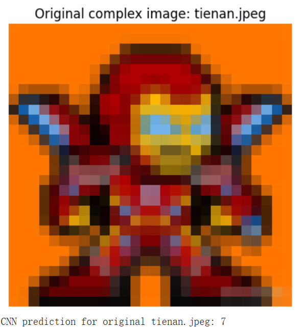
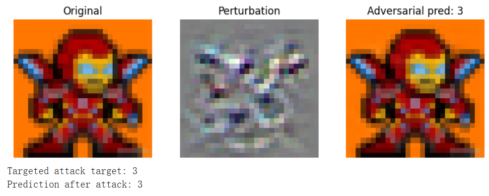
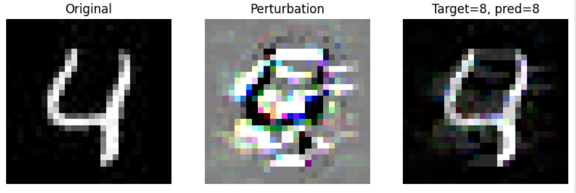

# 对抗样本实验报告
**学号：3230104177**
**姓名：陈奕诺**

---

## 1. 实验基础与模型构建

本实验围绕 MNIST 手写数字分类任务，训练并比较两个模型：一个简单 CNN 和一个基于 MobileNetV3-small 修改得到的轻量卷积网络。实验目标是观察模型在对抗扰动、迁移攻击和简单防御处理下的表现变化。

### 1.1 模型架构理解
#### 1.1.1 简单 CNN 模型

CNN 模型主要由卷积层、激活函数、池化层和全连接层组成。卷积层负责提取局部笔画和边缘特征，池化层降低空间维度，全连接层完成 10 类数字分类。对于 MNIST 这类灰度、低分辨率、类别较少的数据集，简单 CNN 的结构已经足够表达主要判别特征，因此它在原始测试集上可以取得很高准确率。

实验中 CNN 在 MNIST 原始测试集上的准确率为 **98.28%**。这说明模型已经能够较好完成正常分类任务，也为后续对抗攻击提供了合理的基线。

#### 1.1.2 MobileNet 模型

MobileNet 使用轻量化卷积结构，原本面向更复杂的图像分类任务。实验中使用 MobileNetV3-small 的特征提取部分，并将最后分类层改为输出 10 类，以适配 MNIST。
与简单 CNN 相比，MobileNet 的结构更深，表达能力更强，但由于 MNIST 本身较简单，复杂模型并不一定带来明显的干净准确率优势。

实验中 MobileNet 在原始测试集上的准确率为 **97.72%**，略低于 CNN，但仍然说明模型已完成有效训练。

### 1.2 代码实现和训练过程
训练过程中，两个模型都采用监督学习方式完成 10 类数字分类，具体使用的重要参数如下：
| 参数             |                               实验中取值 | 作用说明                                                   |
| -------------- | ---------------------------------: | ------------------------------------------------------ |
| 训练集 batch size |                                 64 | 每次参数更新使用 64 张训练图像。较小 batch 可以增加更新频率，适合 MNIST 这类小图像数据集。 |
| 测试集 batch size |                                100 | 测试和对抗样本评估时每次输入 100 张图像，只用于统计 loss 和准确率，不进行参数更新。        |
| epoch 数        |                                  3 | 模型完整遍历训练集 3 次。MNIST 任务较简单，少量 epoch 即可达到较高准确率。          |
| 优化器            |                                SGD | 根据反向传播得到的梯度更新模型参数。                                     |
| learning rate  |                               0.01 | 控制每次参数更新的步长。学习率过大会导致训练不稳定，过小会导致收敛较慢。                   |
| momentum       |                                0.5 | 在 SGD 中引入动量项，使参数更新方向更平滑，减少梯度震荡。                        |
| 损失函数           |                      交叉熵 / 负对数似然损失 | 用于衡量模型输出分布与真实标签之间的差异。                                  |
| 分类类别数          |                                 10 | MNIST 包含数字 0 到 9，因此模型最后输出 10 类。                        |

**整个实验流程如下**：
（1）使用``transforms.ToTensor()``将原始灰度图像转换为 PyTorch 张量，并对输入图像进行归一化处理，使像素分布更加稳定
（2）构造训练集和测试机的批量迭代器，打乱训练集顺序
（3）调用模型完成前向传播，得到 10 个数字类别的预测结果，使用分类损失函数计算预测结果与真实标签之间的差异
（4）调用 ``optimizer.zero_grad()`` 清空上一轮残留梯度，再通过 ``loss.backward()`` 反向传播计算各层参数梯度，最后调用 ``optimizer.step()`` 更新模型参数
（5）迭代执行以上过程，直到达到 epoch 数
（6）使用训练完的模型在测试集上进行测试，计算准确率

两个模型在 MNIST 测试集上的表现如下：

| 模型 | 干净 MNIST 测试集准确率 |
|---|---:|
| CNN | 98.28% |
| MobileNet | 97.72% |

可以看到，两个模型在正常输入上都表现较好。因此，如果后续对抗样本能显著降低准确率，就说明攻击确实改变了模型决策，对抗攻击方法有效。

## 2. 对抗攻击方法实现

### 2.1 FGSM 攻击

FGSM（Fast Gradient Sign Method）是一种单步梯度攻击方法。设输入图像为 $x$，真实标签为 $y$，模型参数为 $\theta$，损失函数为 $J(\theta, x, y)$，FGSM 根据输入方向上的梯度符号构造扰动：

$$
x_{adv} = x + \epsilon \cdot \mathrm{sign}(\nabla_x J(\theta, x, y))
$$

其中 $\epsilon$ 控制扰动大小。

FGSM 的优点是速度快，只需要一次反向传播；缺点是搜索比较粗糙，攻击能力通常弱于多步方法。实验中 FGSM 主要用于理解对抗样本的基本生成方式：模型不只对图像内容敏感，也会对沿损失上升方向构造的小扰动敏感。

在实验中，使用的epsilon参数设置及其效果如下：

当 epsilon 过大时，对原始图像的修改较大，攻击成功率提高，但是图像噪声较强。反之，攻击成功率下降，但是图像扰动更不明显。
但是总体来说，FGSM 需要更高的 epsilon 才能达到较高的攻击成功率。在这样的 epsilon 下，图像的扰动已经非常明显。如下图，为 epsilon = 1 时的可视化结果。

### 2.2 PGD 攻击

PGD（Projected Gradient Descent）可以看作多步 FGSM。它从原图或带随机扰动的图像出发，每一步沿梯度方向更新输入，并将结果投影回 $\epsilon$ 约束范围内：

$$
x^{t+1} = \Pi_{B_\epsilon(x)}(x^t + \alpha \cdot \mathrm{sign}(\nabla_x J(\theta, x^t, y)))
$$

其中 $\alpha$ 为每步步长，$\Pi$ 表示投影操作。与 FGSM 相比，PGD 可以逐步搜索更强的对抗扰动，因此通常具有更高攻击成功率。

不同扰动大小的设置对攻击效果的影响与 FGSM 攻击类似。以一次无目标攻击为例，分别使用
- epsilon = 20/255
- epsilon = 40/255
其他参数保持相同。可以明显看到，前者攻击失败，后者攻击成功，但后者的攻击后图像有更明显的噪点。



### 2.3 有目标攻击与无目标攻击

无目标攻击只要求模型输出任意错误类别，即：

$$
f(x_{adv}) \neq y
$$

有目标攻击则要求模型输出攻击者指定的类别 $y_t$，即：

$$
f(x_{adv}) = y_t
$$

因此，有目标攻击约束更强，通常更难成功。在实现上，无目标攻击通常最大化真实标签损失；有目标攻击则最小化目标标签损失，使模型逐渐把输入判断为指定类别。

实验中对数字 **4** 进行无目标 PGD 攻击，原始预测为 4，攻击后模型预测变为 9。该结果说明，扰动虽然受限在较小范围内，但已经足以改变模型对数字笔画特征的判断。
```python
adv_four_untargeted, pred_untargeted = l_infinity_pgd(
    model=cnn,
    tensor=four_tensor,
    gt=4,
    epsilon=40/255,
    target=None,
    iteration=1000,
    lr=0.01,
    show=True
)
```



实验中完成了数字 **4 → 8** 的目标攻击。攻击后的图像仍保留一定原图结构，但模型预测被引导到目标类别 8。
```python
adv_four_targeted, pred_targeted = l_infinity_pgd(
    model=cnn,
    tensor=four_tensor,
    gt=4,
    epsilon=40/255,
    target=8,
    iteration=1400,
    lr=0.01,
    show=True
)
```


### 2.4 复杂图像攻击

除 MNIST 数字外，实验还对复杂图像 `tienan.jpeg` 进行了目标攻击。该实验说明，对抗攻击思想并不局限于手写数字分类任务。只要模型输入可微，并且可以计算输入梯度，就可以对更复杂的图像构造扰动。

在复杂图像实验中，原始预测类别为 7，目标攻击将其引导到类别 3。与 MNIST 相比，复杂图像包含更多纹理和背景信息，因此扰动的可视化效果和模型响应更难直观解释，但实验结果仍体现了梯度攻击对模型决策的影响。

如图，模型将图像预测为7。但是，攻击者利用有目标攻击，可以让模型错误输出 3 的结果。



## 3. 对抗样本迁移性分析

### 3.1 迁移攻击概念

对抗样本迁移性指的是：在一个模型上生成的对抗样本，也可能欺骗另一个结构不同的模型。迁移性说明不同模型虽然结构不同，但可能学习到了相似的判别边界或脆弱特征。因此，对抗攻击在真实场景中更危险，因为攻击者不一定需要完全知道目标模型结构。

### 3.2 对抗数据集构造

实验中使用 CNN 生成对抗样本集，然后分别在 CNN 和 MobileNet 上测试该对抗样本集。该设置可以观察白盒模型本身的攻击效果，以及攻击样本迁移到另一个模型后的效果。

实验结果如下：

| 模型 | 原始测试集准确率 | 对抗样本准确率 | 准确率下降 |
|---|---:|---:|---:|
| CNN | 98.28% | 34.80% | 63.48% |
| MobileNet | 97.72% | 50.30% | 47.42% |

CNN 的准确率从 98.28% 降至 34.80%，说明白盒攻击非常有效。MobileNet 的准确率也从 97.72% 降至 50.30%，说明 CNN 生成的对抗样本对不同结构的模型仍有较强迁移效果。

### 3.3 对抗数据集结构
对抗数据集可以视作一个新的测试集，主要组成部分如下：
| 数据内容          | 含义                                  |
| ------------- | ----------------------------------- |
| `adv_images`  | 经过 PGD 扰动后的 MNIST 图像                |
| `labels`      | 对应原始图像的真实标签                         |
| `adv_dataset` | 由对抗图像和真实标签组成的数据集                    |
| `adv_loader`  | 用于按 batch 读取对抗样本并测试模型性能的 DataLoader |

其中，输入图像已经被 CNN 模型的梯度信息有针对性地修改。这些修改在人眼看来可能只是较小的噪声或局部像素变化，但对于神经网络来说，扰动可能会改变其提取到的边缘、笔画和局部形状特征，从而使模型产生错误分类。

### 3.3 两个模型的性能差异

在 CNN 生成的对抗样本集上，CNN 的准确率下降到 34.80%，MobileNet 的准确率下降到 50.30%。其中 CNN 的下降最明显，这是因为这些对抗样本正是根据 CNN 的梯度和决策边界生成的，因此对 CNN 具有更强的白盒攻击效果。PGD 在生成样本时直接利用 CNN 的梯度信息，使扰动方向更容易推动样本越过 CNN 的分类边界。

MobileNet 虽然没有参与对抗样本生成，但其准确率也从 97.72% 下降到 50.30%，说明 CNN 生成的对抗样本对 MobileNet 也具有一定攻击效果。这体现了对抗样本的迁移性：不同神经网络虽然结构不同，但它们在同一数据集上学习到的部分特征和决策边界可能存在相似性。因此，一个模型上的有效扰动，也可能影响另一个模型的分类结果。

不过，MobileNet 在对抗样本集上的准确率高于 CNN，说明迁移攻击通常弱于白盒攻击。CNN 是对抗样本的源模型，攻击过程直接针对 CNN 优化；而 MobileNet 是目标迁移模型，攻击并没有直接使用 MobileNet 的梯度信息。因此，虽然对抗样本能够迁移，但迁移后的攻击强度会有所下降。

## 4. 防御方法讨论

### 4.1 去噪防御

去噪防御的思想是对输入进行平滑、滤波或压缩，尝试去除高频扰动。例如 GaussianBlur 可以降低局部像素噪声，使图像更平滑。它的优点是实现简单，不需要重新训练模型；缺点是可能同时破坏原始图像中的有效细节，并且对自适应攻击不稳定。

本实验实现了 GaussianBlur 防御，代码如下：
```python
def denoise_tensor_batch(x):
    """
    对一个 batch 的图像做 GaussianBlur。
    输入 x 是已经 Normalize 后的 tensor。
    这里先反归一化回 [0,1]，模糊后再 Normalize。
    """
    blur = transforms.GaussianBlur(kernel_size=3, sigma=(0.1, 1.0))

    mean_cpu = torch.tensor([0.1307, 0.1307, 0.1307]).view(1, 3, 1, 1)
    std_cpu = torch.tensor([0.3081, 0.3081, 0.3081]).view(1, 3, 1, 1)

    x_cpu = x.detach().cpu()

    # 反归一化回 [0,1]
    x_raw = x_cpu * std_cpu + mean_cpu
    x_raw = torch.clamp(x_raw, 0, 1)

    # 对每张图做高斯模糊
    x_blur = torch.stack([blur(img) for img in x_raw])

    # 再归一化，保持和模型输入一致
    x_blur_norm = (x_blur - mean_cpu) / std_cpu

    return x_blur_norm.to(device)

```
结果如下：

| 模型 | 防御前对抗准确率 | GaussianBlur 后准确率 | 变化 |
|---|---:|---:|---:|
| CNN | 34.80% | 47.00% | +12.20% |
| MobileNet | 50.30% | 40.40% | -9.90% |

GaussianBlur 对 CNN 有一定提升，使准确率从 34.80% 提高到 47.00%；但对 MobileNet 反而降低了准确率。这说明简单滤波不是稳定防御方法，其效果依赖模型结构和对抗扰动特征。

### 4.2 对抗样本检测

检测方法试图区分正常样本和对抗样本。例如可以根据输入统计特征、模型输出置信度、隐藏层激活分布等判断样本是否异常。其优点是可以作为模型前置安全模块；缺点是检测器本身也可能被绕过，并且需要额外数据训练。

### 4.3 对抗训练

对抗训练是在训练过程中加入对抗样本，使模型学习更平滑、更鲁棒的决策边界。它通常比简单去噪更有效，但训练成本更高，并且可能降低干净样本准确率。对于本实验的 MNIST 场景，可以进一步将 PGD 生成的样本加入训练集，再比较模型在干净样本和对抗样本上的准确率。

## 5. 实验结论与安全意义

本实验表明，CNN 和 MobileNet 在干净 MNIST 测试集上都能达到较高准确率，但在 PGD 对抗样本上性能明显下降。CNN 生成的对抗样本不仅能显著攻击 CNN 自身，也能迁移攻击 MobileNet，说明对抗样本具有跨模型风险。GaussianBlur 对 CNN 有一定防御效果，但对 MobileNet 不稳定，说明简单预处理不能作为充分可靠的安全方案。

从不同模型的鲁棒性差异来看，CNN 在对抗样本集上的准确率低于 MobileNet，说明 CNN 对自身生成的 PGD 对抗样本更脆弱。MobileNet 虽然也受到明显影响，但准确率仍高于 CNN，说明迁移攻击通常弱于直接白盒攻击。造成这种差异的原因在于，PGD 攻击在生成扰动时直接利用 CNN 的梯度信息，扰动方向更贴近 CNN 的决策边界；而 MobileNet 没有参与攻击样本生成，因此攻击对它的适配性较弱。不过，MobileNet 仍然出现接近一半样本分类错误，说明模型结构不同并不能完全避免对抗样本风险。

从 AI 安全角度看，对抗样本说明模型可能依赖人类不易察觉的脆弱特征进行判断。当攻击者沿着模型梯度方向添加微小扰动时，这些扰动在人类视觉上可能并不明显，但却足以改变模型内部特征表示，使模型输出错误类别。在真实世界应用中，例如自动驾驶、医学影像和身份识别系统，输入中的微小扰动可能导致错误决策。

在实际应用中，需要综合使用对抗训练、输入检测、模型集成、预处理防御和安全监控等多种方法，构建多层防御体系。只有这样，才能在提高模型性能的同时增强 AI 系统在真实环境中的安全性和可信度。可以使用输入检测、模型集成、预处理方法，以及引入人工复核机制处理此类攻击。

## 附录：加分项
在本次实验中，主要做了如下拓展与优化：
**1. 原始代码优化和改进**
在 PGD 攻击实验中，原始脚本给出的函数和流程如下：
```python
def l_infinity_pgd(model, tensor, gt,epsilon=40./255, target=None,iteration=500, show=True):
    delta = torch.zeros_like(tensor, requires_grad=True)
    opt = optim.SGD([delta], lr=0.1)
    print(target)
    for t in range(iteration):
        pred = model(norm(tensor + delta))
        if target is None:
            loss = -nn.CrossEntropyLoss()(pred, torch.LongTensor([gt]))
        else:

            loss = - 0.5 * nn.CrossEntropyLoss()(pred, torch.LongTensor([4])) + 
                   nn.CrossEntropyLoss()(pred, torch.LongTensor([target]))
        if t % 50 == 0:
            print(t, loss.item())

        opt.zero_grad()
        loss.backward()
        opt.step()
        delta.data.clamp_(-epsilon, epsilon)
```
这段代码的原理是，把扰动当成一个可训练参数，用优化器使用普通梯度优化扰动更新，类似神经网络的更新方式。事实上，代码没有引入标准的 PGD 更新公式。因此，在攻击效率上表现较差。在实际测试时，迭代超过 700 轮，依然无法对目标产生有效攻击。
在我的改进代码里，我引入了标准 PGD 的更新公式，代码如下：
```python
    for i in range(iteration):
        delta.requires_grad = True

        adv_x = torch.clamp(x + delta, 0, 1)
        output = model(adv_x)

        # 无目标攻击：最大化真实类别的分类损失
        loss = F.nll_loss(output, y)

        model.zero_grad()
        if delta.grad is not None:
            delta.grad.zero_()

        loss.backward()

        # PGD: 沿着梯度符号方向增加 loss
        grad = delta.grad.detach()
        delta = delta + alpha * grad.sign()

        # 投影回 L∞ epsilon 范围
        delta = torch.clamp(delta, -epsilon, epsilon)

        # 保证图像像素仍在 [0, 1]
        delta = torch.clamp(x + delta, 0, 1) - x
        delta = delta.detach()
```
再次尝试攻击，发现攻击效率大大提升。仅使用 15 次迭代，就成功诱导模型输出了错误的标签。这次优化大大节省了计算的成本，同时显著提升了攻击性能。

**2. 可视化工具**
在实验中，为了更直观地分析对抗扰动的影响，本文在实验中加入了可视化展示。对于单样本攻击，分别展示原始图像、扰动图像以及攻击后的对抗样本，并标注攻击前后的模型预测类别。

在可视化界面上，观察Perturbation，可以看到图像所受的扰动。通过修改超参数等，观察Perturbation，可以更加方便地判断参数如何影响扰动程度，比直接比较原图和处理后的图像准确。

**3. 探索性研究：图像预处理防御**
参照网络提供的常见防御方法，我实现了 GaussianBlur 防御，并且在两个模型上进行实验，实验结果在正文已经详细描述。此外，我还通过查找其他资料，整理了其他与预处理有关的防御机制：
- Bit-depth reduction，把原本连续或高精度的像素值压缩到更少的离散等级来压缩原图，使得传入图像中的小幅度对抗扰动被抹掉，缓解对抗样本影响
- Median smoothing：用局部窗口的中位数替代中心像素，可以抑制对抗扰动中的局部高频噪声，但也可能模糊数字边缘，导致部分干净样本分类性能下降。
- JPEG compression：JPEG 压缩会对图像进行频域变换、量化和重编码。由于许多对抗扰动位于高频细节中，压缩过程可能会去除部分攻击噪声。对于自然图像任务，JPEG 是常见的轻量级防御方法。对于 MNIST 这类灰度图，JPEG 的优势可能不如彩色自然图像明显，但仍可作为一种输入重编码实验。
- Random resizing and padding：在推理前加入随机输入变换，使攻击扰动难以稳定作用于固定像素位置。对于 MNIST，可以尝试轻微平移、随机 padding 或小幅仿射变换。该方法的优点是能增加攻击者优化难度；缺点是随机变换可能影响正常样本，并且对自适应攻击并不一定可靠。